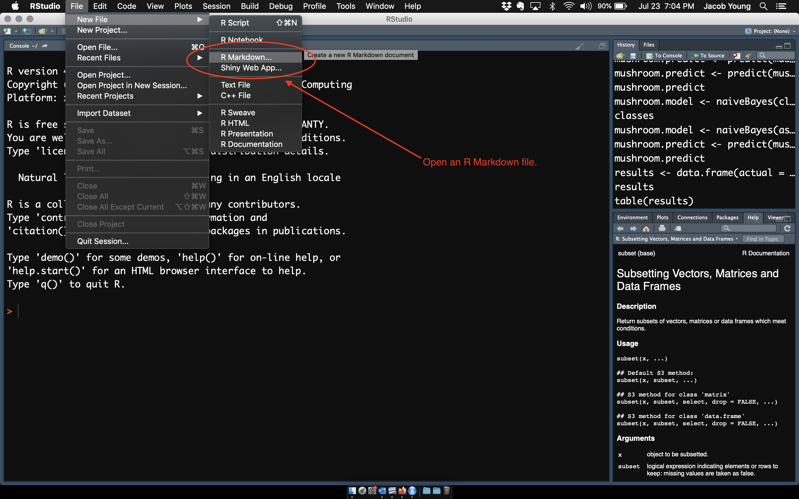

<style>
body {
text-align: justify}
</style>

<br>

In this lab, you will be introduced to RMarkdown using RStudio. A great feature of RStudio is that you can create so-called data-driven documents that combine text and analysis into a "reproducible" document. In other words, it allows you to write all of the text, syntax for the analysis, etc. and keep it in a document. This way you are not bouncing between programs and everything is reproducible. This is ideal if you are using a publicly available data set or for making your workflow reproducible.

Why are you learning this? We will be using RMarkdown templates for your homework assignments in this course. When you get to the homework assignments with templates, you will be working with RMarkdown. So, we want to start learning it early!

*Also*, this is a skill you should develop as you expand your data analysis tool kit. 

<br>

# **Data-Driven Documents**    

## What are Data-Driven Documents?

Data-driven documents are formats that combine text and analysis (i.e. data and code). By combining everything in a single file, we promote transparency and reproducibility. For any given table, figure, or model in the document, you should be able to easily discern how it was created, from what data, and what analysis was used.

We will use the [R Markdown](https://rmarkdown.rstudio.com/lesson-1.html) format.

### How do Data-Driven Documents Work?

All of the document formats build from a simple text formatting convention called [markdown](https://github.com/adam-p/markdown-here/wiki/Markdown-Cheatsheet).

To create an R Markdown document, you need three things:

  1. A header to specify the document type
  2. Some text (formatted in markdown)
  3. Some code (inside a "code chunk")

<br>

Let's see how it works!
  
<br>


## RMarkdown in RStudio

First, you need to install the `rmarkdown` and `knitr` packages using:  

```{r, echo = TRUE, eval = FALSE}
install.packages( "rmarkdown" )
install.packages( "knitr" )
```

<br>

Now, let's take a look at how it works. Open a new RMarkdown file using the drop-down menu as shown below:  

<br>



<br>

Then, use the options to pick the type of file you want to create.

<br>

Afterwards, click on the knit function in the .Rmd pane:  

<br>

 
<br>

You did it!  

<br>

## A Closer Look

### Knitting R Markdown Files

Code is placed inside of "chunks" in the documents:

[](../gifs/NewCodeChunk/NewCodeChunk.html)

When you "knit" a file R Studio will run all of code, embed the output into your document, and then convert the file to whichever type you have specified in the file header.  

<br>

## Output Types

You can select from many different document types, including HTML pages, Microsoft word, presentation formats, or dashboards.

<br>

**Check out these examples:**

[R Markdown Formats](https://rmarkdown.rstudio.com/formats.html)  
[R Markdown Gallery](https://rmarkdown.rstudio.com/gallery.html)  

<br>

### HTML Pages

```r
---
output: html_document
---
```

[](../gifs/html_format/html_format.html)

<br>

### Dashboards

```r
---
output: flexdashboard::flex_dashboard:
---
```

[](../gifs/DashboardExample/DashboardExample2.html)


[ [dashboard example](https://cultureofinsight.shinyapps.io/crypto_tracker/) ]  [ [source code](https://cultureofinsight.shinyapps.io/crypto_tracker/) ]  [ [blog about the tracker](https://www.cultureofinsight.com/blog/2018/01/22/2018-01-22-building-a-cryptocurrency-tracker-with-r/) ]  

<br>

### PDFs

```r
---
output: pdf_document
---
```

<br>

#### A note on PDFs

If you would like to knit to PDF you need one additional program. TeX creates publication-quality PDF files. The open-source version is called MiKTeX [download page](http://miktex.org/download).

If you have problems, you can find some nice tutorials like this one: 
<https://www.reed.edu/data-at-reed/software/R/r_studio_pc.html>

<br>

## Working with Markdown

Markdown is a set of simple conventions for formatting text in R Markdown (RMD) files. 

It makes it easy to create professional documents with minimal effort. 

Here are the basic formatting rules for Markdown:


### Headers

```
# Heading One (h1)

## Heading Two (h2)

### Heading Three (h3)

#### Heading Four (h4)

##### Heading Five (h5)

###### Heading Six (h6)
```

<br>

### Text Style

```
With Markdown, it is possible to emphasize words by making them *italicized*, using *astericks* or _underscores_, or making them **bold**, using **double astericks** or __double underscores__. 

Of course, you can combine those two formats, with both _**bold and italicized**_ text, using any combination of the above syntax. 

You can also add a strikethrough to text using a ~~double tilde~~.
```

With Markdown, it is possible to emphasize words by making them *italicized*, using *astericks* or _underscores_, or making them **bold**, using **double astericks** or __double underscores__. 

Of course, you can combine those two formats, with both _**bold and italicized**_ text, using any combination of the above syntax. 

You can also add a strikethrough to text using a ~~double tilde~~.

<br>

### Lists

#### Unordered

```
* First item
* Second item
* Third item
    * First nested item
    * Second nested item
```
* First item
* Second item
* Third item
    * First nested item
    * Second nested item

#### Ordered

```
1. First item
2. Second item
3. Third item
    1. First nested item
    2. Second nested item
```
1. First item
2. Second item
3. Third item
    1. First nested item
    2. Second nested item

<br>

### Hyperlinks

Create links by wrapping the link text in square brackets [ ], and the URL in adjacent parentheses ( ). 

```
[Google News](https://news.google.com)
```

[Google News](https://news.google.com)

<br>

### Images

Insert images in a similar way, but add an exclamation mark in front of square brackets ![ ], and the image file name goes in the parentheses ( ). 

```

```

The *alt text* appears when the image cannot be located, or is read by devices for the blind when the mouse hovers over the image. It 

<br>

Or you can link directly to an image online using the URL address of the image:

```

```


<br>

### Tables

```
| Title 1          | Title 2          | Title 3         | Title 4         |
|------------------|------------------|-----------------|-----------------|
| First entry      | Second entry     | Third entry     | Fourth entry    |
| Fifth entry      | Sixth entry      | Seventh entry   | Eight entry     |
| Ninth entry      | Tenth entry      | Eleventh entry  | Twelfth entry   |
| Thirteenth entry | Fourteenth entry | Fifteenth entry | Sixteenth entry |

```

| Title 1          | Title 2          | Title 3         | Title 4         |
|------------------|------------------|-----------------|-----------------|
| First entry      | Second entry     | Third entry     | Fourth entry    |
| Fifth entry      | Sixth entry      | Seventh entry   | Eight entry     |
| Ninth entry      | Tenth entry      | Eleventh entry  | Twelfth entry   |
| Thirteenth entry | Fourteenth entry | Fifteenth entry | Sixteenth entry |

<br>


# **Summary**    

Why are you learning this? We will be using RMarkdown templates for your homework assignments in this course. When you get to the homework assignments with templates, you will be working with RMarkdown. So, we want to start learning it early!

<br>

# **Github Issues**    

Let's navigate to the [HELP! page](https://jacobtnyoung.github.io/SAND/topics/page-99-help.html) for this course to see how Github Issues works.

----

#### ***Questions?***

<br>

##### ***Please*** report any needed corrections to the [Issues](https://github.com/jacobtnyoung/SAND/issues/new) page. Thanks!

<br>

<p align="center">
[Back to SAND main page](https://jacobtnyoung.github.io/SAND/)
</p>
