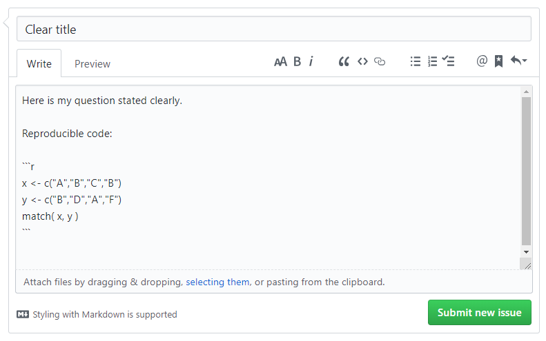
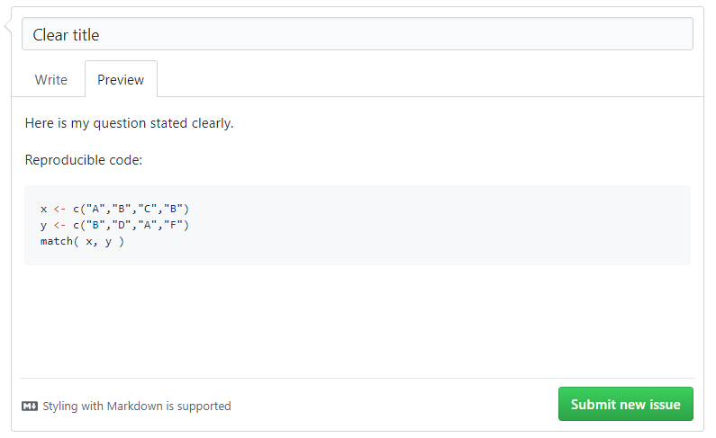

<style>
body {
text-align: justify}
</style>

```{r setup, include=FALSE}
knitr::opts_chunk$set( echo = TRUE )
```

<br>


<br>

### Getting help...

It is okay to ask for help. *Actually*, it is encouraged! Asking for help is a key ingredient in the learning process (or recipe?). Knowing **how** to get help is just as important as asking.

In this course, we use [GitHub Issues](https://github.com/jacobtnyoung/SAND/issues) for posting questions. This is approach is becoming more common as network analysts, and research in general, moves to open science platforms.

<br>

#### Why [GitHub Issues](https://github.com/jacobtnyoung/SAND/issues)?  

Several reasons:  

  + When you send me an email, only I see it. You probably have a really good question that others are thinking about as well. If other people can see if, then they can realize they are not alone in their frustration (see gif above). Also, others can help you if they have run across the same problem and/or know what to do.  
  
  + As you will see below, [GitHub Issues](https://github.com/jacobtnyoung/SAND/issues) understand Markdown (we will be using Markdown in our lab templates). So, it is **much** easier to ask and answer questions when the interface can render our code. (An alternative is to copy and paste into an email, then change the font, and then...yeah, let's not do that).  
  
  + You will learn a new skill! Asking questions in a way that it is clear, concise, and provides the information needed for someone to offer a solution is a valuable skill to learn and hone through practice. For some examples see:  
    + [StackOverflow](https://stackoverflow.com) has a succinct guide on [asking clear questions](https://stackoverflow.com/help/how-to-ask)
    
    + Jon Skeet has an excellent [blog post](https://codeblog.jonskeet.uk/2010/08/29/writing-the-perfect-question/) on the topic

<br>

### Some Simple Rules for Clear Questions  

Here are some simple rules to use when getting help.

#### (1) Don't Repeat Questions  

Check the [existing list of questions and topics](https://github.com/jacobtnyoung/SAND/issues) to make sure your questions has not been asked already. Often times the answer already exists, you just need to read a couple of previous discussions.

<br>

#### (2) Include Your Code  

This question below is difficult to answer because we don't know how the error was generated unless you share your code:

---

> I am trying to merge my data but I keep getting the error message, "x is not a factor".

<br>

You need to show the code that generated the error message. Try something like:

---

> I am trying to merge my data, but I keep getting the error message, "cannot merge object type list". Here is my code:

```r
x <- data.frame( id=letters[1:10], v1=rnorm( 10 ) )
y <- data.frame( id=letters[1:10], v2=rbinom( 10 ) )
z <- list( x, y )
merge( y, z )
```

---

<br>

GitHub speaks Markdown, which allows you to include reproducible code. Here is what it will look like when you enter it:

<br>

<br>


And here is what it will look like when submitted (to see this before submitting, click the "Preview" tab):

<br>

<br>

<br>

#### (3) Include Data

You can include data in your questions in a few ways.

There are some functions that allow you generate random data that can be used to demonstrate the problem.

Many packages include built-in datasets that can be easily loaded with the `data()` function.

```r
data( USArrests )
head( USArrests )
           Murder Assault UrbanPop Rape
Alabama      13.2     236       58 21.2
Alaska       10.0     263       48 44.5
Arizona       8.1     294       80 31.0
Arkansas      8.8     190       50 19.5
California    9.0     276       91 40.6
Colorado      7.9     204       78 38.7
```

<br>

### Style Guides

Computer languages have rules that are similar to grammar rules in natural languages. This is called "syntax". Unlike grammar, syntax is strictly enforced in most computer languages because improper syntax will result in code that does not run.

There is another idiosyncratic aspect of computer code called "style". Since computer code for the most part ignores spaces, you don't have punctuation, and you can nest functions, style describes how readable and clear your code is. You can write accurate and functional code that is really hard to interpret. With good style it will be easier to share and maintain.

There are two popular style guides for R:

* [The Google R Style Guide](https://google.github.io/styleguide/Rguide.xml)
* [The Tidyverse Style Guide](http://style.tidyverse.org/index.html)

Think of these suggestions as good habits that will make your life easier and will improve your ability to collaborate with others.

Keep in mind that your code might *technically* be correct, but it is much easier to read if you treat each argument as a separate word and use spaces accordingly. Which is easier to understand?

```r
y<-cut(rank(x),breaks=seq(from=1,to=100,by=10),labels=paste("X",1:10,sep=""))
```

Or:

```r
y <- cut( rank( x ), breaks=seq( from=1, to=100, by=10 ), labels=paste( "X", 1:10, sep="" ) )
```

<br>

### Github Issues Page for *This* Course

To review the existing issues for this course, use this link: [https://github.com/jacobtnyoung/SAND/issues](https://github.com/jacobtnyoung/SAND/issues)  

To post a new issue for this course, use this link:
[https://github.com/jacobtnyoung/SAND/issues/new](https://github.com/jacobtnyoung/SAND/issues/new)  


<br>

____

<br>

<p align="center">
[Back to SAND main page](https://jacobtnyoung.github.io/SAND/)
</p>

<br>

<br>

#### ***Please*** report any needed corrections to the [Issues](https://github.com/jacobtnyoung/SAND/issues/new) page. Thanks!

<br>
<br>